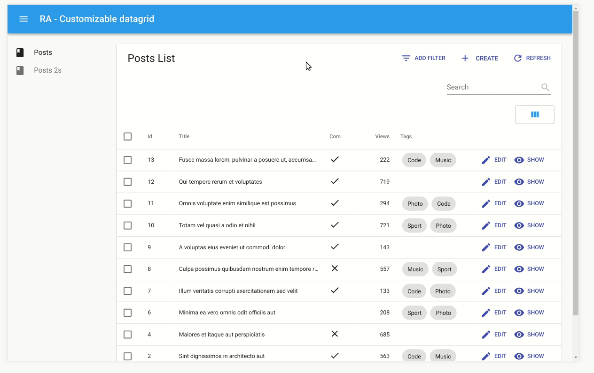

<div align="center">
  <div style="margin-bottom: 20px">
    [](ra-customizable-datagrid)
  </div>

  <a href="https://fizix.io" rel="noopener" target="_blank"></a>
</div>

<h1 align="center">ra-customizable-datagrid for <a rel="noopener" target="_blank" href="https://github.com/marmelab/react-admin/">React Admin</a></h1>

<div align="center">

[React Admin](https://github.com/marmelab/react-admin/) plugin that allows to hide / show columns dynamically.

</div>


## Preview

<a href="https://fizix-io.github.io/ra-customizable-datagrid/" rel="noopener" target="_blank">Demo link</a>

<p align="center">
  
</p>


## Features

* Users can show/hide columns, obviously
* Users preferences are stored by resource
* The storage mechanism can be replaced
* Developers can choose the default visible columns

## Installation

ra-customizable-datagrid is available from npm. You can install it (and its required dependencies) using:

```
$> npm install --save ra-customizable-datagrid
```
or
```
$> yarn add ra-customizable-datagrid
```

Then replace React Admin `Datagrid` by `CustomizableDatagrid`

```jsx
import CustomizableDatagrid from 'ra-customizable-datagrid';

const PostList = props => (
  <List {...props}>
    <CustomizableDatagrid>
      <TextField source="id" />
      <TextField source="title" />
    </CustomizableDatagrid>
  </List>
);
```

## Configuration

### Storage

By default LocalStorage is used to store user preferences.

If you need to store them somewhere else, use the `storage` props like this :

```jsx
<CustomizableDatagrid storage={CustomStorage}>
```

where CustomStorage is an object with the `set` and `get` methods :

```js
const CustomStorage = {
  get: (resourceName) => /* your own logic here */,
  set: (resourceName, selectedColumns) => /* your own logic here */,
};
```

### Default columns

All the columns are visible by default.

This behavior can be changed with the `defaultColumns` prop. Just pass an array containing the name of the columns you want to be visible.

```jsx
import CustomizableDatagrid from 'ra-customizable-datagrid';

const PostList = props => (
  <List {...props}>
    <CustomizableDatagrid defaultColumns={['title']}>
      <TextField source="id" />
      <TextField source="title" />
    </CustomizableDatagrid>
  </List>
);
```

## How to run the demo locally

```
$> npm run demo-install
$> npm run demo
```

## License

`ra-customizable-datagrid` is licensed under the MIT License, sponsored and supported by <a href="https://fizix.io/" rel="noopener" target="_blank">Fizix</a>.
